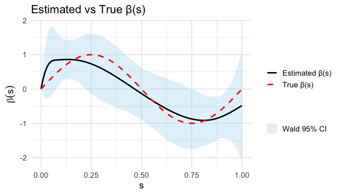
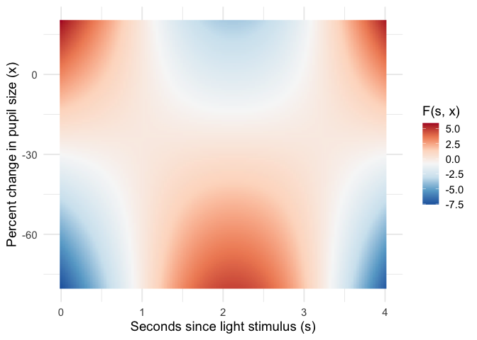

<!-- README.md is generated from README.Rmd. Please edit README.Rmd -->

# funAFT

An R package for **functional accelerated failure time (AFT) models**:

- **Linear functional AFT (lfAFT)** with a functional predictor entering
  as

$$
  \int_S X_i(s) \beta(s) ds
$$

and estimated via penalized splines.

- **Additive functional AFT (afAFT)** where the functional predictor
  enters as

$$
  \int_S F[s, X(s)]  ds
$$

with an unknown bivariate function $F(\cdot,\cdot)$, fitted using
tensor-product smooths in **mgcv**.

The package currently supports:

- lfAFT: lognormal and loglogistic AFT models.  
- afAFT: lognormal AFT family only.

### Installation

------------------------------------------------------------------------

You can install the development version of funAFT from
[GitHub](https://github.com/weijia-qian/funAFT/) with:

``` r
install.packages("devtools")
devtools::install_github("weijia-qian/funAFT")
```

### Data structure

------------------------------------------------------------------------

Both lfAFT and afAFT assume:

- `Y`: positive survival times
- `delta`: censoring indicator (1 = observed event, 0 = right-censored)
- `X`: **wide functional covariate matrix** (one row per subject, one
  column per grid point)
- `Z`: scalar covariates (optional)

For convenience, you typically store everything in one `data.frame`:

``` r
head(dat)
#>   Y delta Z  X1   X2   X3  ...  X50
#> 1 ...   ...   ...  ...  ...  ...
```

You refer to functional columns either by explicit names
(e.g. `"X1", "X2", ...`) or via a regex pattern (e.g. `"^X"` with
`x_as_regex = TRUE`).

### 1. Linear functional AFT model: `fit_lfAFT()`

------------------------------------------------------------------------

The linear functional AFT model assumes

$$
  \log T_i = Z_i^\top \gamma + \int_S X_i(s) \beta(s) ds + \sigma \varepsilon_i,
$$

with lognormal or loglogistic errors. The coefficient function
$\beta(s)$ is represented using spline basis functions, and a roughness
penalty is applied to control smoothness.

#### Automatic selection of the smoothing parameter $\lambda$

The smoothing parameter $\lambda$ is selected by conducting a grid
search over `lambda_grid`. Internally:

- `optimize_lambda()` evaluates GCV score for each candidate $\lambda$
  in the `lambda_grid`
- the $\lambda$ minimizing GCV is chosen
- the final model is refit at that optimal $\lambda$

`lambda_grid` can be user-supplied or by default consists of 100
exponentially spaced values from 1e3 to 1e4.

#### Example: fitting loglogistic lfAFT with pupil data

The package includes a sample dataset, `pupil`, containing 123 subjects
who completed a pupillary light response test. The dataset includes:

- Functional covariates
  - `pct_chg_1` to `pct_chg_119`: record the percent change in pupil
    diameter at 119 equally spaced time points following a light
    stimulus. Each row represents a subject’s functional pupil response
    curve $X_i(s)$.
- Survival outcome
  - `time_since_use`: survival time (estimated minutes since last
    cannabis use)
  - `is_user`: censoring indicator (1 = observed, 0 = right-censored)
- Scalar covariates
  - `age_in_years` and `bmi`

In the following example, we show how to fit a log-logistic lfAFT model
of time since cannabis use on pupil response curves using `fit_lfAFT()`.

``` r
library(funAFT)
data(pupil)

sgrid = seq(0, 4, len = 119) # grid of observed points
lambda_grid = exp(seq(log(1000), log(20000), length.out = 100))

# log-logistic lfAFT model with Wald standard errors and 95% CIs
fit_lf<- fit_lfAFT(data = pupil, y = "time_since_use", delta = "is_user", x = "^pct_chg_", x_as_regex = TRUE,
                    z = c("age_in_years", "bmi"), s_grid = sgrid, lambda_grid = lambda_grid, family = "loglogistic", se = TRUE)
```

By specifying `bootstrap = TRUE`, you can obtain bootstrap confidence
intervals. By default use 500 bootstrap replicates (`B = 500`).

``` r
# log-logistic lfAFT model with Wald and bootstrap 95% CIs
fit_lf_boot <- fit_lfAFT(data = pupil, y = "time_since_use", delta = "is_user", x = "^pct_chg_", x_as_regex = TRUE,
                    z = c("age_in_years", "bmi"), s_grid = sgrid, lambda_grid = lambda_grid, family = "loglogistic", 
                    se = TRUE, bootstrap = TRUE, B = 2000)
```

#### Inspecting Estimated Coefficient Function $\hat\beta(s)$

``` r
library(ggplot2)
df_plot <- data.frame(
  s = fit_lf_boot$s_grid,
  beta_hat = fit_lf_boot$betaX_hat,
  wald_lower = fit_lf_boot$betaX_ci_lower,
  wald_upper = fit_lf_boot$betaX_ci_upper,
  boot_lower = fit_lf_boot$betaX_boot_ci_lower,
  boot_upper = fit_lf_boot$betaX_boot_ci_upper
)

ggplot(df_plot, aes(x = s)) +
  geom_ribbon(aes(ymin = wald_lower, ymax = wald_upper, fill = "Wald 95% CI"), alpha = 0.25, na.rm = TRUE) +
  geom_ribbon(aes(ymin = boot_lower, ymax = boot_upper, fill = "Bootstrap 95% CI"), alpha = 0.25, na.rm = TRUE) +
  geom_line(aes(y = beta_hat, color = "Estimated β(s)"), linewidth = 0.8) +
  labs(x = "Seconds since light stimulus (s)", y = expression(beta(s)), title = "Estimated Coefficient Function β(s)", fill = "", color = "") +
  scale_fill_manual(values = c("Bootstrap 95% CI" = "#FDE725", "Wald 95% CI" = "#7AD151")) +
  scale_color_manual(values = c("Estimated β(s)" = "grey20")) +
  theme_minimal(base_size = 14)
```



#### Prediction with `predict_lfAFT()`

``` r
newdata <- pupil[1:5, ]

# linear predictor mu
mu_new <- predict_lfAFT(fit_lf, newdata, type = "link")

# median survival time exp(mu)
tmed_new <- predict_lfAFT(fit_lf, newdata, type = "response")

# survival probabilities at t = 1, 2, 5
S_new <- predict_lfAFT(fit_lf, newdata, type  = "survival", times = c(1, 2, 5))
```

### 2. Additive functional AFT model: `fit_afAFT()`

------------------------------------------------------------------------

The additive functional AFT model allows the functional predictor to
enter through a more flexible bivariate function:

$$
  \log T_i = Z_i^\top \gamma + \int_S F[s, X_i(s)] ds + \sigma \varepsilon_i,
$$

where $F(\cdot,\cdot)$ is unknown and estimated using a tensor-product
smooth via **mgcv**.

#### Implementation details

- Build matrices

  - `X`: functional covariate (n × p)  
  - `S`: replicated grid of observed points (n × p)  
  - `L`: quadrature weights (n × p) via the trapezoid rule

- Fit a tensor-product smooth

  ``` r
    ti(S, X, by = L, bs = basis, k = k, mc = (FALSE, TRUE))
  ```

  where `mc = c(FALSE, TRUE)` imposes marginal identifiability
  constraints in the functional covariate direction.

#### Example: fitting lognormal afAFT model with pupil data

``` r
fit_af <- fit_afAFT(data = pupil, y="time_since_use", delta = "is_user", x = "^pct_chg_", x_as_regex = TRUE,
                    z = c("age_in_years", "bmi"), s_grid = sgrid)
```

#### Estimated coefficient surface $\hat F\{s, X(s)\}$

``` r
xgrid <- as.matrix(seq(-80, 20, len = 119), ncol = 1)
sgrid <- fit_af$s_grid
df_pred <- expand.grid(X = xgrid, S = sgrid) 
df_pred$L <- 1
df_pred$age_in_years <- mean(pupil$age_in_years)
df_pred$bmi <- mean(pupil$bmi)
pred_smooth <- predict(fit_af, newdata = df_pred, type = "terms", terms = "ti(S,X):L", se = TRUE)
df_pred$fit <- pred_smooth$fit

ggplot(df_pred, aes(x = S, y = X, fill = fit)) +
  geom_raster(interpolate = TRUE) +
  labs(
    x = "Seconds since light stimulus (s)",
    y = "Percent change in pupil size (x)",
    fill = "F(s, x)"
  ) +
  scale_fill_distiller(palette = "RdBu") +
  theme_minimal(base_size = 14)
```



#### Prediction with `predict_afAFT()`

Same usage as `predict_lfAFT()`.

``` r
# linear predictor mu
eta_af <- predict_afAFT(fit_af, newdata, type = "link")

# median survival time exp(mu)
tmed_af <- predict_afAFT(fit_af, newdata, type = "response")

# survival probabilities at t = 1, 2, 5
S_af <- predict_afAFT(fit_af, newdata, type = "survival", times = c(1, 2, 5))
```

### References

------------------------------------------------------------------------

- Qian, W., Cui, E., Brooks-Russell, A., & Wrobel, J. (2025).  
  *Functional Accelerated Failure Time Models for Predicting Time Since
  Cannabis Use.*  
  arXiv preprint arXiv:2510.22343.  
  <https://doi.org/10.48550/arXiv.2510.22343>

- Wood S N (2017). *Generalized Additive Models: An Introduction with
  R.* 2nd ed. Chapman & Hall/CRC.

- `mgcv::cnorm` documentation:  
  <https://rdrr.io/cran/mgcv/man/cnorm.html>
